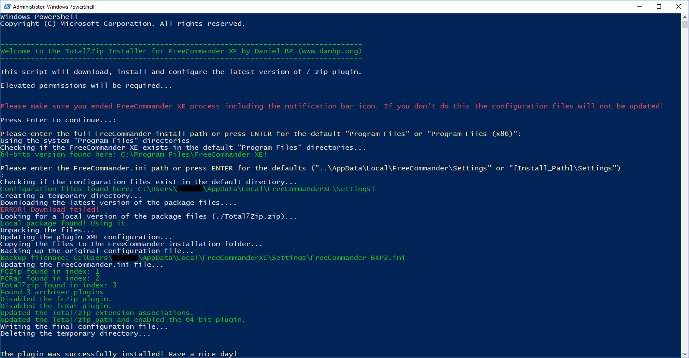
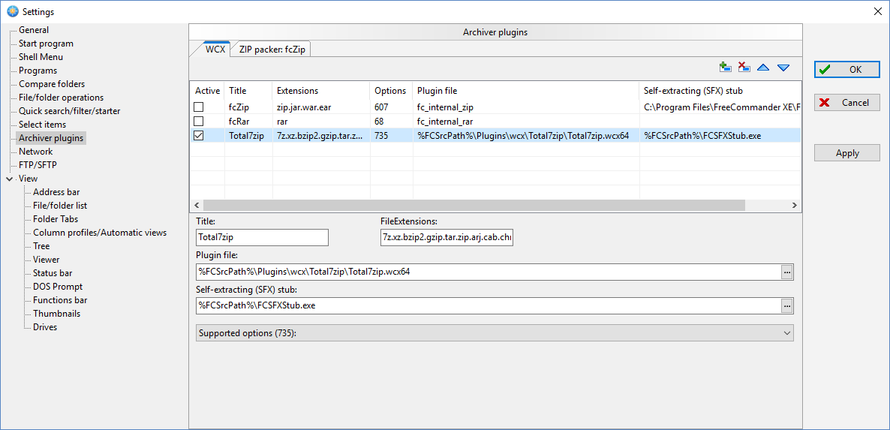

# FreeCommander XE Total7zip Plugin Installer

This is a PowerShell script for the automatic installation of the latest version of the Total7zip plugin in FreeCommander XE.

7-Zip is one of the most complete archivers supporting a huge range of compressed file types. Total7zip plugin does not require 7-Zip to be installed on the device.

## Current 7-Zip library version
* 23.01

## Tested with
* FreeCommander XE Build 894 (64-bit) and 880 (32-bit)

## Features
* Automatic download and installation of the latest version of the Total7zip plugin. 
* Automatic configuration of FreeCommander XE for the appropriate file associations (7z, xz, bzip2, gzip, tar, zip, arj, cab, chm, cpio, cramfs, deb, dmg, fat, hfs, iso, lzh, lzma, mbr, msi, nsis, ntfs, rar, rpm, squashfs, udf, vhd, wim, xar, z, gz, vhdx)
* Run again to update 7-Zip library to the latest version (if available). 
* Automatic backup of the original configuration files before performing any changes. 
* Works with 32-bit and 64-bit versions of Free Commander XE. 
* Open Source for maximum transparency. You can also use it to learn PowerShell :)

## Instructions
1. Terminate the FreeCommander XE application
2. Download [total7zipinstaller.ps1](https://danpeig.github.io/freecommander_total7zip_installer/total7zipinstaller.ps1) script. If you are running a portable version save the script inside the FreeCommander installation folder so it can detect the path automatically. The *.ps1* file is the only one you need to download.
3. Run *total7zipinstaller.ps1* script: right click on the file (context menu) ->  select *Run with Powershell*. Depending on your Windows configuration, you might have allow the execution or even 'unblock' the script (see troubleshooting).
3. If you are running FreeCommander from a custom installation directory, enter the full directory path, otherwise just continue. The script will try to find the correct path.
4. If your FreeCommander configuration files are in a custom directory, enter the full path for the configuration directory, otherwise just continue. The script will try to find the correct path.
5. After the installation, start FreeCommander and test packing and unpacking a *7z* file.

## Uninstall
1. From FreeCommander XE configuration menu, delete the entries for the 7Zip archiver plugin.
2. Delete the *Plugins/wcx/Total7zip* folder from the FreeCommander XE installation folder (usually *Program Files\Free Commander XE*).

## Troubleshooting
* **Not able to download the Total7zip package:** Download the [Total7Zip.zip](https://danpeig.github.io/freecommander_total7zip_installer/Total7Zip.zip) file from the repository. Place in the same folder as the script and run the script again.
* **Script was blocked because it was not signed:** Right click on the script file, select properties and 'unblock'.
* **Optional admin rights:** Are required to modify installed versions of FreeCommander. If you are using the portable version, you don't need admin rights. In this case, delete the "Self-elevate" portion of the script and run again.
* **Can't find FreeCommander path:** Depending on your system language settings, the input prompt for a custom install path will not work. In this case, edit the script file and add the paths manually. Required fields:  `defaultInstallPath64` or `defaultInstallPath32` and `defaultConfigPath`.

## FAQ
* **Why did you disabled the built-in plugins?** 7-Zip library is offers more configuration options and is compatible with more file types. I disabled the standard plugins to keep a consistent user experience among different packagers.
* **Can I re-enable the built in plugins?** Yes, all plugins can co-exist. If you don't change the order they will be used as prioritary for opening the specified file types. When packing you will always be presented all the options available.
* **Is it safe to run a PowerShell script?** Safer than a compiled binary file - you can see how it works even before downloading (from GitHub). I took extra precautions to explain all commands used in the script.
* **How do I update the file associations for the plugin?** Navigate to the Tools Menu->Settings->Archiver plugins->Total7zip.

## Changelog

### Version 1.6 (07/10/2023)
* Updated 7-Zip library to 23.01, latest stable.
* Downloads the 7-Zip plugin directly from GitHub repository, not from my personal website.
* Updated troubleshooting section.

### Version 1.5 (06/02/2022)
* Updated 7-Zip library to 21.07 latest stable.

### Version 1.4 (24/10/2021)
* Fixed 32-bit version default installation directory name

### Version 1.3 (14/03/2021)
* Updated 7-Zip library to 21.01 alpha as several important bugs were fixed since version 19.

### Version 1.2 (21/10/2020)
* Fixed BOM in the generated INI configuration files.
* Fixed installation on systems without the built-in archiver plugins configured.
* Automatic detection of installation path if the script is placed in the FreeCommander.exe installation folder (nice for Portable versions).
* Display the script version during startup.

### Version 1.11 (20/10/2020)
* Added a final pause to prevent the PowerShell window from closing automatically in some systems.

### Version 1.1 (19/10/2020)
* Automatic detection of the settings folder for portable installations
* Automatic detection of 32-bit and 64-bit FC versions
* Using %FCSrcPath% relative paths instead of hard-linked plugin locations ensuring full portability
* Improved user interface with some colors

### Version 1.0 (15/10/2020)
* Initial release

## Credits
* 7-Zip Copyright © 1999-2020 Igor Pavlov (https://www.7-zip.org/)
* Total 7-Zip plugin from TotalCmd.net (http://totalcmd.net/plugring/Total7zip.html)
* FreeCommander XE Copyright © 2004-2020 Marek Jasinski (www.freecommander.com)

## Bugs and feature requests
* Please contact me at www.danbp.org

## Screenshots

